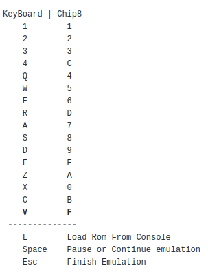

# Chip8-Emulator

This is an emulator of the chip8 interpreter (technical refence: http://devernay.free.fr/hacks/chip8/C8TECH10.HTM),
it was made using SDL2 and visual studio code (in the settings from .vscode include: ["/usr/include/SDL2", "${default}"])
,for compilation use
g++ -o app.o emulator.cpp processor.cpp input.cpp  graphics.cpp main.cpp `sdl2-config --cflags --libs`

Controls:

    
